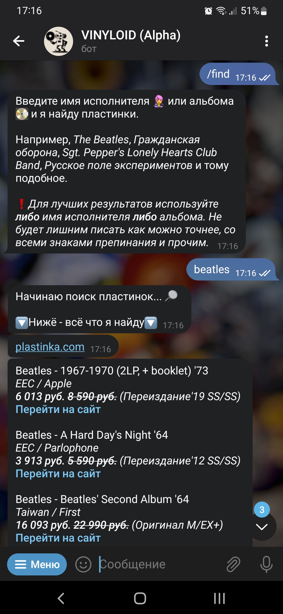
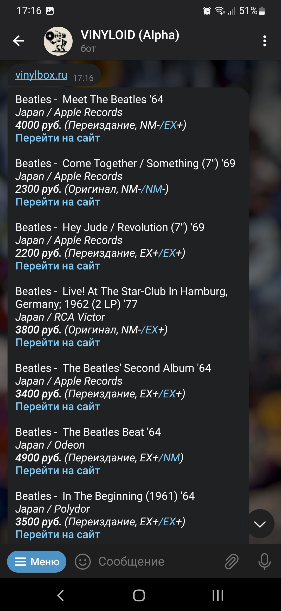
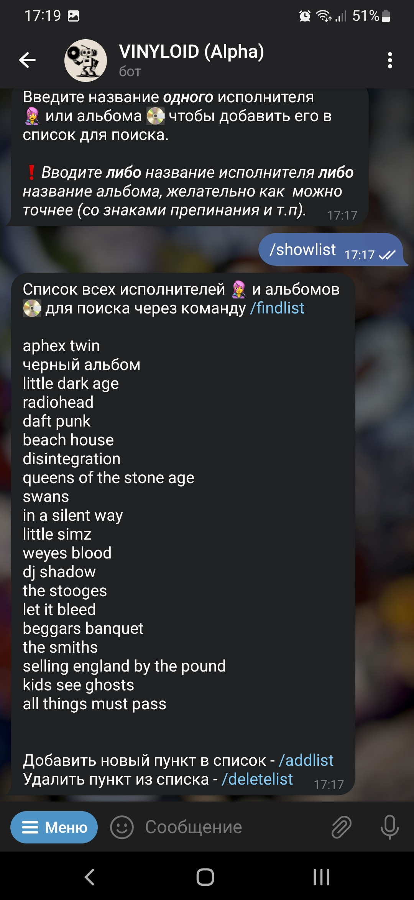

# Vinyloid Telegram Bot
 
Telegram-бот на PHP для поиска виниловых пластинок в Интернет-магазинах. Позже проект перерос в сайт <a href="http://vinyloid.ru" target="_blank">Vinyloid.ru</a>.

 
Представляет собой парсер получающий информацию с сайтов plastinka.com и vinylbox.ru и выводящий информацию в удобном для чтения виде.

 
Пользователь вводит в чате текст для поиска (название артиста или пластинки), после чего происходит парсинг и результаты возвращаются в виде серии сообщений. 

 
Кроме того в боте можно сохранять список исполнителей и пластинок и искать их всех одним запросом, вместо того чтобы писать несколько.

 
Бот написан с использованем библиотек: <a href="https://github.com/TelegramBot/Api">PHP Telegram Bot Api</a>, <a href="https://github.com/vlucas/phpdotenv">PHP dotenv</a> и <a href="https://github.com/voku/simple_html_dom">Simple Html Dom Parser for PHP</a>.

 
 
Ниже можно увидеть несколько изображений как это работало

 
 
 
 
 
